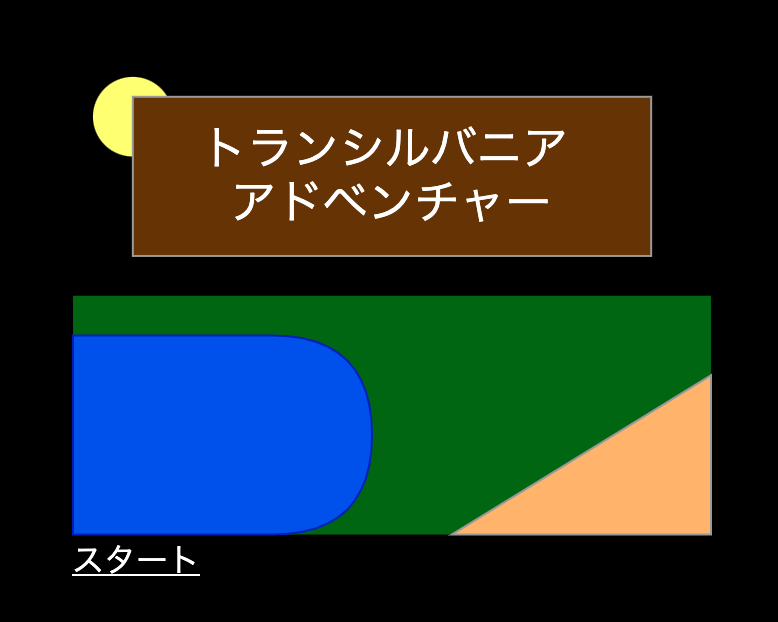

# kobo-adventure

HTMLベースで作ったアドベンチャーゲームです。



## 準備

```bash
$ npm install
```

## 実行

```bash
$ npm start
```

## 遊び方

ブラウザで次のURLを開きます。

```
http://localhost:5000/
```

## 追伸

ワザと無駄の多いコードにしています。もっとシンプルにするにはどうすれば良いか考えてみてね。
